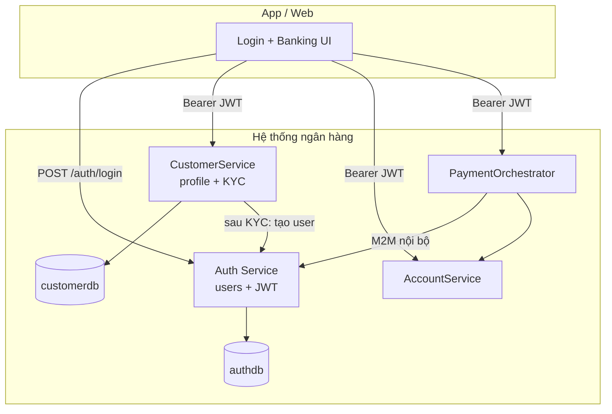

# Kịch bản: Đăng nhập trên hệ thống của bạn (user thật)

Tài liệu mô tả **hiện trạng** repo `banking-pos`, **best practice**, và **kịch bản mục tiêu** khi login/register dùng **user DB của chính ngân hàng**, không phụ thuộc Auth0 cho end-user.

---

## 1. Hiện trạng project `banking-pos`

| Thành phần | Việc đang làm |
|------------|----------------|
| **CustomerService** | Hồ sơ khách (`customerdb`), KYC, `externalId` — **không** lưu password login |
| **AuthUser** | Internal IAM: login, refresh, JWT issuer, `POST /api/v1/internal/users` sau KYC |
| **commons-security** | Mọi service validate JWT (`issuer-uri`, `auth.jwt.audience`) |
| **Account / Biller / Payment** | Chỉ tin JWT + `@PreAuthorize` |

### Luồng hôm nay

```
Đăng ký profile → CustomerService (DB bạn)
KYC VERIFIED    → AuthUser → `POST /api/v1/internal/users`
Mở app          → Login AuthUser → JWT
Gọi API         → Bearer JWT (issuer AuthUser)
```

**Hệ quả:** User đăng nhập nằm trong `auth_users` (AuthUser); profile khách nằm trong `customers` (CustomerService).

### Port service (local dev)

| Service | Port |
|---------|------|
| CustomerService | 8083 |
| AccountService | 8084 |
| PaymentOrchestrator | 8086 |
| BillerService | 8088 |
| BillPayWorkerService | 8090 |
| AuthUser | 8094 |

---

## 2. Best practice (ngân hàng / fintech)

### Nên tách (giữ ý tưởng microservice)

| Lớp | Trách nhiệm |
|-----|-------------|
| **Customer / Party** | Hồ sơ pháp lý, KYC, địa chỉ |
| **Identity / Credential** | Email, password hash, MFA, refresh token |
| **Authorization** | Role, scope, quyền truy cập tài khoản |
| **Account / Payment** | Nghiệp vụ tiền — **không** tự làm login |

Liên kết bằng **`customer_id` / `external_id`** ổn định (1 customer ↔ 1 identity user).

### Login “trên hệ thống mình” — các lựa chọn

| Lựa chọn | Mô tả |
|----------|--------|
| **A. IAM nội bộ** *(khuyến nghị cho “user thật của tôi”)* | Auth service: DB `users`, Argon2/bcrypt, JWT do bạn ký |
| **B. Keycloak / OIDC self-hosted** | Chuẩn OAuth2, infra của bạn, user trong realm của bạn |
| **C. Đổi IdP SaaS** | Thay Auth0 — vẫn không phải API login 100% tự viết |

Kịch bản dưới giả định **A** (IAM nội bộ).

### Best practice kỹ thuật (khi tự làm auth)

- Password: **Argon2id** hoặc **bcrypt** — không plaintext.
- Access token ngắn (15–30 phút) + **refresh token** (rotation).
- Rate limit login, khóa tạm sau N lần sai.
- MFA/OTP cho giao dịch nhạy cảm (giai đoạn sau).
- Audit log: login success/fail, IP, device.
- **Không** lưu password trong bảng `customers` — bảng `users` riêng.

### Ngân hàng thật vs project demo

| | Demo (repo) | Ngân hàng thật (tổng quát) |
|--|-------------|----------------------------|
| Lưu customer / account | Service + DB riêng | Core / microservices nội bộ |
| Login app | Auth0 (SaaS ngoài) | Thường IAM nội bộ hoặc vendor banking |
| Tách domain vs identity | Có | Rất phổ biến |

---

## 3. Mục tiêu

- User lưu trong **database / service của bạn**.
- App gọi **`POST /auth/login`** trên backend bạn — không redirect Auth0.
- JWT do **bạn phát & verify** — `commons-security` đổi issuer/JWKS sang Auth service.
- CustomerService vẫn quản KYC; sau KYC tạo **user login** nội bộ (thay Auth0).

---

## 4. Kịch bản người dùng (user journey)

### Giai đoạn 1 — Đăng ký (chưa login)

| Bước | Ai | Hành động | Hệ thống |
|------|-----|-----------|----------|
| 1 | Khách | Điền form đăng ký trên app/web của bạn | `POST /api/v1/customers` → **CustomerService** |
| 2 | Hệ thống | Tạo customer `kyc_status=PENDING`, `active=false` | `customerdb` |
| 3 | Khách | Thông báo: chờ xác minh KYC | Chưa có tài khoản login |

### Giai đoạn 2 — KYC & kích hoạt identity

| Bước | Ai | Hành động | Hệ thống |
|------|-----|-----------|----------|
| 4 | Ops / KYC tự động | Duyệt hồ sơ | `PATCH /api/v1/customers/{id}/kyc-status` → `VERIFIED` |
| 5 | Hệ thống | Tạo user đăng nhập gắn `customer_id` | **Auth service** (mở rộng AuthUser): `POST /internal/users` hoặc tự động trong flow KYC |
| 6 | Hệ thống | Email/SMS đặt mật khẩu (tuỳ chọn) | Token one-time set password |
| 7 | DB | `customers.active=true` | `users.customer_id = customers.external_id` |

*Thay bước gọi Auth0 Management API bằng insert `users` + password hash.*

### Giai đoạn 3 — Đăng nhập (100% hệ thống bạn)

| Bước | Ai | Hành động | Hệ thống |
|------|-----|-----------|----------|
| 8 | Khách | Màn Login trên app ngân hàng | Không Auth0 |
| 9 | Khách | Email + mật khẩu | `POST /auth/login` → **Auth service** |
| 10 | Auth | Verify hash, user enabled, customer VERIFIED + active | `authdb.users` |
| 11 | Auth | Trả `access_token` + `refresh_token` | JWT claims: `sub`, `customer_id`, scopes |
| 12 | App | Lưu token, gọi API kèm `Authorization: Bearer ...` | |

### Giai đoạn 4 — Dùng app

| Bước | API | Ghi chú |
|------|-----|---------|
| 13 | CustomerService | `SCOPE_fdx:customers.read` |
| 14 | AccountService | Mở tài khoản — kiểm tra KYC |
| 15 | PaymentOrchestrator | Bill pay — user JWT; M2M nội bộ giữa service |

### Giai đoạn 5 — Luồng phụ

| Tình huống | API / hành vi |
|------------|----------------|
| Sai mật khẩu | 401, lock tạm |
| Token hết hạn | `POST /auth/refresh` |
| Đăng xuất | Revoke refresh token |
| Quên mật khẩu | `forgot-password` → email → `reset` |
| Đổi mật khẩu | Cần mật khẩu cũ + đã login |

---

## 5. Kiến trúc mục tiêu



**Zero-trust giữ nguyên:** mỗi microservice validate JWT; chỉ đổi **issuer** từ Auth0 → Auth service của bạn.

---

## 6. Mô hình dữ liệu gợi ý

```
customers (CustomerService)          users (Auth service)
─────────────────────────          ─────────────────────
external_id  ◄────────────────────  customer_id
email                              email (unique)
kyc_status                         password_hash
active                             enabled
                                   failed_login_count
                                   last_login_at
```

**Rule:** 1 email = 1 customer = 1 user login. Login bị chặn nếu `kyc_status != VERIFIED` hoặc `active = false`.

---

## 7. Roadmap thay đổi so với repo hiện tại

| # | Việc | Ghi chú |
|---|------|---------|
| 1 | Bảng `users` trong Auth service | Mở rộng AuthUser hoặc service mới |
| 2 | `POST /auth/login`, `/refresh`, `/logout` | Public + rate limit |
| 3 | JWT + JWKS endpoint | `commons-security` đổi `issuer-uri` |
| 4 | CustomerService KYC | Gọi tạo user nội bộ thay Feign Auth0 |
| 5 | `JwtToAuthConverter` | Map roles/scopes từ DB hoặc claim tùy chỉnh |
| 6 | Postman collection | Flow login → token → API |
| 7 | (Sau) MFA, device binding | Production |

**Giữ nguyên:** CustomerService (profile), Account, Biller, Payment — chỉ đổi **tầng identity**.

---

## 8. API Auth gợi ý (contract sơ bộ)

### `POST /api/v1/auth/login`

**Request:**

```json
{
  "email": "customer@example.com",
  "password": "********"
}
```

**Response 200:**

```json
{
  "access_token": "<JWT>",
  "refresh_token": "<opaque>",
  "expires_in": 1800,
  "token_type": "Bearer"
}
```

**JWT claims gợi ý:**

| Claim | Ví dụ |
|-------|--------|
| `sub` | user uuid |
| `customer_id` | `external_id` từ CustomerService |
| `permissions` / `scope` | `fdx:accounts.read`, … |
| `iss` | `https://api.mockbank.local/auth` |
| `aud` | `https://mockbank/api` |

### `POST /api/v1/auth/refresh`

Body: `{ "refresh_token": "..." }` → access token mới.

### `POST /api/v1/internal/users` *(nội bộ, sau KYC)*

Chỉ service-to-service (M2M hoặc network nội bộ):

```json
{
  "email": "customer@example.com",
  "customerId": "cust-ext-001",
  "temporaryPassword": "..." 
}
```

---

## 9. Kịch bản test local (Postman)

1. `POST {{customer_base}}/api/v1/customers` → lưu `external_id`.
2. `PATCH .../kyc-status` body `{ "kycStatus": "VERIFIED" }` → tạo user trong `authdb`.
3. `POST {{auth_base}}/api/v1/auth/login` → copy `access_token`.
4. Gọi `GET {{account_base}}/api/v1/accounts` với Bearer token.

Không cần tenant Auth0.

---

## 10. Rủi ro & lưu ý

- Tự làm auth = bạn chịu trách nhiệm bảo mật credential (Auth0 đang gánh phần này).
- Cần tuân OWASP: brute force, token leakage, CORS, secure storage trên mobile.
- Production lớn: cân nhắc **Keycloak self-hosted** (lựa chọn B) thay vì viết từ đầu.

---

## 11. So sánh nhanh: trước / sau consolidation

| | Trước (Auth0-centric) | Hiện tại (IAM nội bộ) |
|--|----------------------|------------------------|
| Đăng ký profile | CustomerService | CustomerService |
| Login UI | Auth0 Universal Login | App → AuthUser `/api/v1/auth/login` |
| User credential | Auth0 | `authdb.auth_users` |
| JWT issuer | `*.auth0.com` | AuthUser (`http://localhost:8094` dev) |
| Sau KYC | Auth0 Management API | `POST /api/v1/internal/users` |
| M2M service | Auth0 `client_credentials` | AuthUser `/oauth/token` + `mockbank-auth` provider |

---

## 12. Tóm tắt

**Hiện tại:** profile trên hệ thống bạn, login trên Auth0.

**Mục tiêu:** profile **và** login cùng ecosystem — user trong DB bạn, JWT do bạn cấp; Customer / Account / Payment giữ nguyên, chỉ thay **tầng identity** và flow sau KYC.

---

*Tài liệu tham chiếu code: `CustomerService`, `AuthUser`, `commons-security`, `UseCases/SecurityUseCase.txt`.*
